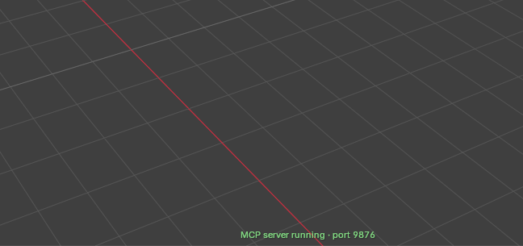
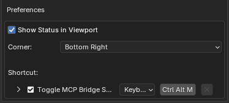

# MCP Toggle

**English** | [한국어](README.ko.md)

[](https://www.blender.org/)
[](LICENSE)
[](https://github.com/bada0817/blender-mcp-toggle/releases/latest)

A small Blender extension that **starts and stops the bridge server of the [Blender MCP add-on](https://www.blender.org/lab/mcp-server/) with a single shortcut (Ctrl+Alt+M)**.
While the server is running, its status is shown in a corner of the 3D viewport.



## Why

The MCP add-on only provides two operators, `blmcp.server_start` and `blmcp.server_stop`, and neither has a `poll`.
Binding both to the same key doesn't pick the right one based on the server state,
and calling start while the server is already running fails with `Server is already running`.

This extension adds a toggle operator that checks the server state and calls the matching operator.
The MCP add-on's code is not modified.

## Features

- **`blmcp_toggle.toggle`** operator (label: *Toggle MCP Bridge Server*)
  - Calls `blmcp.server_stop` when the server is running, `blmcp.server_start` when it's stopped.
  - Since the original operators are called, preferences (host, port, etc.), timer registration and error reporting behave exactly as in the MCP add-on.
  - Disabled with the message "The MCP add-on is not enabled" when the MCP add-on is off.
- **Ctrl+Alt+M shortcut registered automatically** (in the Window keymap, so it works in every editor)
  - Can be changed right in the add-on's preferences.
- **Viewport status** (since 2.0.0)
  - Only while the server is running, shows the actual listening port in a corner of the 3D viewport, e.g. `MCP server running · port 9876`.
  - Bottom-right by default. Can be moved to the bottom-left or turned off in the preferences.

## Requirements

- Blender 5.1 or newer
- The [MCP add-on](https://www.blender.org/lab/mcp-server/) installed and enabled

## Installation

### Option 1: Install the release zip (recommended)

Download `mcp_toggle-<version>.zip` from [Releases](https://github.com/bada0817/blender-mcp-toggle/releases/latest),
then in Blender choose it from **Edit → Preferences → Get Extensions → ⌄ (top right) → Install from Disk...**.

### Option 2: Build it yourself

```bash
git clone https://github.com/bada0817/blender-mcp-toggle.git mcp_toggle
cd mcp_toggle
blender -b --command extension build
```

Install the generated `mcp_toggle-<version>.zip` with **Install from Disk...** as above, or from the command line:

```bash
blender -b --command extension install-file -r user_default -e mcp_toggle-<version>.zip
```

### Option 3: Link as a local repository (for development)

Code changes take effect after restarting Blender or toggling the add-on off and on.

1. Use the **parent folder** of the clone (e.g. `~/blender_addons` for `~/blender_addons/mcp_toggle`).
2. Add it in **Edit → Preferences → Get Extensions → ⌄ → Repositories → `+` → Add Local Repository**.
3. Enable *MCP Toggle* in the **Add-ons** tab.

## Usage

- Press **Ctrl+Alt+M**.
- Or run *Toggle MCP Bridge Server* from the F3 search.

The status bar shows `MCP bridge server started` / `MCP bridge server stopped`,
and while the server is running its status stays visible in a corner of the 3D viewport.

### Preferences

Expand **Preferences → Add-ons → MCP Toggle**:



### Viewport status

Configure it in the add-on's preferences:

- **Show Status in Viewport**: turn the status on or off
- **Corner**: `Bottom Right` (default) or `Bottom Left`

Behavior:

- The port shown is the one the server socket is actually listening on. After changing **Port** in the MCP add-on's preferences and restarting the server, the status follows.
- Turning off the viewport **Overlays** hides it as well.
- With Region Overlap enabled, it stays clear of the toolbar (T) and the sidebar (N). When the sidebar is open it moves left of it, like the navigation gizmo.
- The server state is only read while the viewport draws, there is no polling timer.
  When the server is started or stopped with the buttons in the MCP add-on's preferences, the status updates on the next viewport redraw (e.g. when moving the mouse over the viewport).

### Changing the shortcut

Under **Shortcut** in the add-on's preferences, click the key field (`Ctrl Alt M`) and press the new key combination.
The checkbox turns the shortcut off, and the arrow expands more options (e.g. Press/Release, key repeat).

This is the same item as in **Preferences → Keymap** (search for *Toggle MCP Bridge Server*), so either place works.
Changes are saved with the preferences (use **Save Preferences** if Auto-Save is off)
and kept when the add-on is updated or re-enabled. **Restore** in the Keymap preferences resets it to Ctrl+Alt+M.

If you previously bound start/stop to the same key yourself, remove those entries to avoid conflicts.

## How it works

The server state comes from the MCP add-on's `mcp_to_blender_server.is_running()` (whether the listening socket exists).
The add-on's package name depends on the repository it's installed in (e.g. `bl_ext.user_default.mcp`),
so the `mcp_to_blender_server` module is looked up among the enabled add-ons.

The viewport status is drawn with `blf` from a `POST_PIXEL` callback registered with `SpaceView3D.draw_handler_add`.

## Note

If an MCP client such as Claude Code is connected to Blender through this server, stopping the server also drops that connection.

## License

[GPL-3.0-or-later](LICENSE), following Blender's add-on license requirements and the MCP add-on's license.
